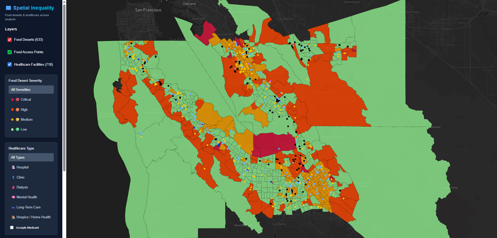

# Geospatial Inequality Dashboard

A full-stack geospatial dashboard visualizing **food-access and healthcare-access disparities across the 9-county San Francisco Bay Area**. It renders ~1,588 census tracts colored by food-desert severity, overlaid with ~1,930 real licensed healthcare facilities, using viewport-based loading so only visible features are fetched and drawn.

> Built as a geospatial-engineering portfolio project. Data is real: U.S. Census tract geometry, USDA food-access metrics, and California state facility licensing data, integrated in PostGIS and served as GeoJSON.



## What it shows

- **Food desert severity** — each Bay Area census tract classified using the USDA Food Access Research Atlas definitions (low-income and/or low-access), rendered as choropleth polygons.
- **Healthcare facilities** — real licensed facilities (hospitals, clinics, dialysis, mental health, long-term care, hospice/home health), filterable by type, with bed counts and Medi-Cal acceptance.
- **Derived access zones** — per-tract healthcare-access scoring based on PostGIS distance from tract centroid to the nearest hospital/clinic.

## Tech stack

**Frontend**
- Next.js 16 (App Router) + React 19 + TypeScript
- Deck.gl 9 (`GeoJsonLayer` for tract polygons, `ScatterplotLayer` for facilities)
- react-map-gl + Mapbox GL (dark basemap)
- Zustand (state), Tailwind CSS, Framer Motion

**Backend**
- Next.js API routes (TypeScript, serverless — not Express)
- `pg` driver against PostGIS; geometry serialized via `ST_AsGeoJSON`

**Database**
- PostgreSQL 16 + PostGIS 3.4 (Docker Compose)
- Redis and pgAdmin included in the compose stack
- GiST spatial indexes on all geometry columns

**Data pipeline**
- Python: GeoPandas (shapefile + spatial ops), pandas, SQLAlchemy + GeoAlchemy2 (`to_postgis`), psycopg2

## Data sources

| Layer | Source | Notes |
|-------|--------|-------|
| Census tract geometry | U.S. Census **TIGER/Line 2010**, California (FIPS 06) | 2010 vintage chosen deliberately to match the Atlas (see below) |
| Food-access metrics | **USDA Food Access Research Atlas 2019** | Tract-level low-income / low-access flags, population, poverty, vehicle access |
| Healthcare facilities | **California HCAI / CDPH** licensed & certified facility data | State licensing authority; replaced a discontinued federal source |

### Why 2010 tract geometry

The USDA Atlas 2019 data is keyed to **2010-vintage** census tracts. Tract boundaries and GEOIDs are redrawn each decennial census, so pairing the 2019 Atlas with 2010 TIGER geometry yields an **exact GEOID join** with zero attribute loss. Using 2020 boundaries would require a crosswalk and introduce approximation — noted as future work.

### Why a California state source for healthcare

The original plan used a federal infrastructure dataset (HIFLD Open), but that public portal was **discontinued in September 2025**. The California HCAI/CDPH licensed-facility dataset is a stronger fit for a California-scoped project anyway: it is the actual licensing authority, is unambiguously public, and includes facility type, bed capacity, and Medi-Cal participation.

## Data pipeline

The pipeline runs in verifiable stages (`data/`), each checking its output before the next builds on it:

1. **Read tracts** — load TIGER shapefile, filter to the 9 Bay Area counties (~1,588 tracts), inspect CRS.
2. **Read Atlas** — load Atlas CSV, repair GEOID leading zeros, verify the GEOID set joins cleanly to TIGER.
3. **Load `census_tracts`** — reproject 4269→4326, join Atlas attributes, compute `pct_without_vehicle`, cast to MultiPolygon, write to PostGIS.
4. **Load `healthcare_facilities`** — filter to Bay Area, map California facility types to the schema enum, spatially join points to tracts (filtering out mislabeled out-of-area records), write points.
5. **Derive zones** — compute `food_desert_zones` (severity from Atlas flags + a continuous access-score composite) and `healthcare_desert_zones` (centroid-to-facility distances, severity bands) entirely in PostGIS.

### Running the pipeline

```bash
# 1. Start the database stack
docker compose up -d

# 2. Activate the Python environment (geopandas, pandas, sqlalchemy, geoalchemy2, psycopg2, python-dotenv)
conda activate geo   # or your venv

# 3. Configure DB connection in data/.env  (gitignored)
#    PGHOST, PGPORT, PGDATABASE, PGUSER, PGPASSWORD

# 4. Run the stages in order
python data/stage3_load_tracts.py
python data/stage4_load_healthcare.py
python data/stage5_compute_zones.py
```

Source data files (Census/USDA/HCAI downloads) are large and **not committed** — download them locally and point the stage scripts at their paths.

## Key engineering decisions

- **Schema shaped to real data, not the reverse.** California licenses no "urgent care" or "dental" facility *type*, but does license dialysis, long-term care, and hospice/home-health. The healthcare category set was reshaped to match the actual licensing taxonomy rather than forcing data into placeholder categories.
- **GEOID leading-zero repair.** The Atlas CSV stores tract IDs numerically, dropping leading zeros (California `06…` arrives as `6…`). Left unhandled, every join silently fails. The pipeline reads IDs as strings and zero-pads to 11 characters; a join-integrity check verifies the fix.
- **MultiPolygon geometry.** Real census tracts include multipart polygons (islands, water-split tracts). Geometry columns use `GEOMETRY(MultiPolygon, 4326)` and all geometries are promoted to MultiPolygon on load.
- **Spatial filtering over trusting county codes.** A handful of facilities carry Bay Area county codes but geocode hundreds of miles away. Facilities are filtered by an actual point-in-tract spatial join, which also stamps each facility with its containing tract.
- **Spatial computation in PostGIS.** Distances (`ST_Distance` on `geography`), centroids, and point-in-polygon tests run in the database against GiST indexes, not in application code.

## Database schema

Five core tables (`scripts/init.sql`):

- `census_tracts` — tract polygons + demographics + USDA food-access flags
- `food_access_points` — grocery/market points *(schema present; data is future work)*
- `healthcare_facilities` — facility points, typed, with beds and Medi-Cal flag
- `food_desert_zones` — derived per-tract food-access severity and score
- `healthcare_desert_zones` — derived per-tract healthcare-access severity and distances

All geometry columns carry GiST indexes.

## API

Next.js API routes returning GeoJSON `FeatureCollection`s, all supporting a `bounds` bbox parameter for viewport queries:

```
GET /api/data/food-deserts?severity=critical&bounds=minLng,minLat,maxLng,maxLat
GET /api/data/healthcare?type=hospital&accepts_medicaid=true&bounds=...
GET /api/data/food-access?bounds=...        # returns an empty collection until grocery data is loaded
```

## Frontend setup

```bash
cd frontend
npm install
echo 'NEXT_PUBLIC_MAPBOX_TOKEN=pk.your_token' > .env.local
# also set DB_HOST / DB_PORT / DB_NAME / DB_USER / DB_PASSWORD in .env.local
npm run dev          # http://localhost:3000
```

Before committing: `npm run lint && npm run type-check`.

## Limitations & future work

- **Centroid-distance approximation.** Healthcare access distance is measured straight-line from each tract's centroid to the nearest facility — not road-network distance, and not from where residents actually live within a tract. Road-network routing is a future enhancement.
- **Food-access points not yet loaded.** `food_access_points` (grocery stores, markets) is schema-complete but unpopulated; the food layer currently derives from USDA tract flags. Loading SNAP-retailer or OSM grocery data would enable true nearest-grocery distances.
- **Healthcare severity uses hospital proximity only.** Clinic proximity is recorded but not blended into the severity band; a composite hospital+clinic score is a candidate refinement.
- **2010 tract vintage.** Geometry matches the 2019 Atlas exactly but shows 2010 boundaries. A 2020-vintage upgrade would need a tract crosswalk.
- **Scope.** Currently the 9-county Bay Area. The same sources and pipeline extend to all of California (~8,000 tracts) by widening the county filter; full-US scale would need vector tiles.

## License

MIT — see `LICENSE`.