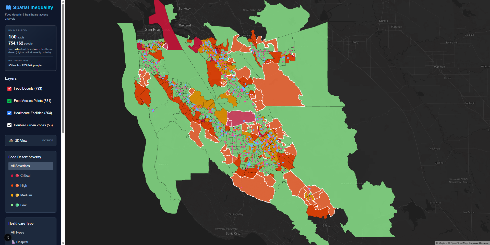
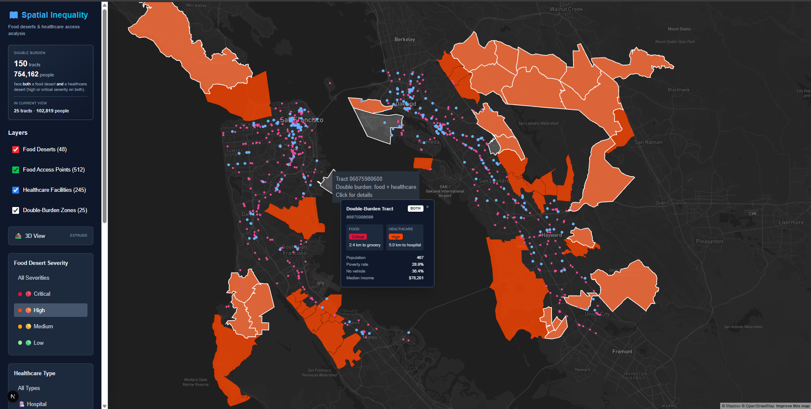
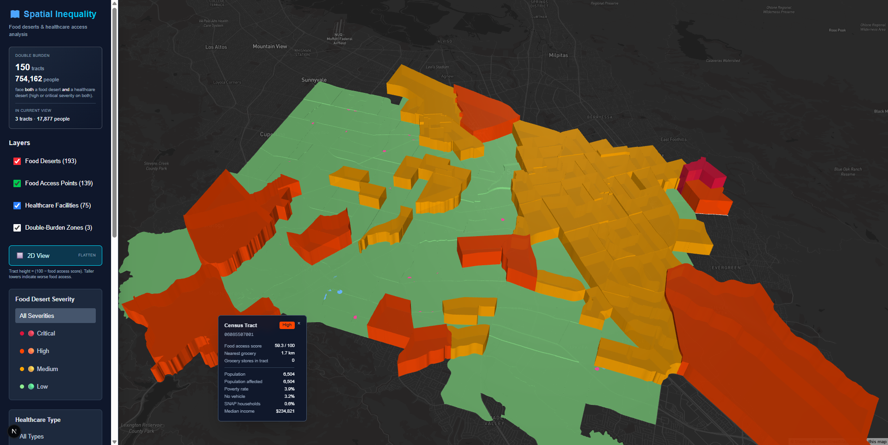

# Geospatial Inequality Dashboard

A full-stack geospatial dashboard surfacing **food and healthcare access disparities across the 9-county San Francisco Bay Area**. Renders ~1,588 census tracts as a food-desert choropleth, overlaid with ~1,930 licensed healthcare facilities and 1,514 USDA-classified grocery stores, with interactive popups, a derived "double-burden" analytical layer, and a 3D extrusion mode that turns the inequality landscape into physical geometry.

> Built as a geospatial-engineering portfolio project. All data is real: U.S. Census tract geometry, USDA food-access metrics, USDA SNAP retailer data, and California state facility licensing data, integrated in PostGIS and served as GeoJSON.



## Headline finding

**150 Bay Area census tracts - about 754,000 people - face both a food desert and a healthcare desert at high or critical severity.** Roughly 9.5% of the region's tracts experience compounding spatial disadvantage. This finding falls out of intersecting the food-access and healthcare-access derived layers; neither layer surfaces it on its own.

## What the dashboard shows

- **Food desert severity** - every Bay Area census tract classified using USDA Food Access Research Atlas 2019 definitions (low-income and/or low-access), rendered as a choropleth.
- **Grocery stores** - 1,514 USDA-defined grocery stores (Supermarket / Super Store / Grocery Store SNAP categories) loaded from the USDA SNAP Retailer Locator, filtered to the Bay Area via spatial join, tract-tagged.
- **Healthcare facilities** - 1,930 California-licensed facilities (hospitals, clinics, dialysis, mental health, long-term care, hospice/home health), filterable by type, with bed counts and Medi-Cal acceptance.
- **Double-burden zones** - derived overlay: tracts classified high-or-critical severity on **both** food and healthcare axes. White-outlined on the map. Sidebar shows regional totals plus a live in-view counter.
- **3D inequality landscape** - toggle that extrudes tracts by `(100 - food access score) x 20m`. Disadvantage becomes physical: the worse the access, the taller the tower.
- **Interactive popups** - hover for a quick tooltip on any feature; click to pin a detail card with full demographic context (population, poverty rate, vehicle access, SNAP households, median income) plus the relevant access metrics.





## How to read the map

Once it's running locally:

1. **Open with default layers** - food deserts (choropleth), grocery dots (pink/magenta), healthcare dots (blue family), all on at zoom 10 over San Francisco.
2. **Click a red or orange tract.** Popup shows the severity classification, food access score, distance to nearest grocery, plus poverty rate, SNAP percentage, and median income for that tract. Compare an SF tract to an East Oakland one - the demographic asymmetry is stark.
3. **Toggle the Double-Burden Zones layer.** White outlines pop on. Watch where they cluster: SE San Jose, East Oakland, parts of Antioch, the Tenderloin/SoMa edge. These are the tracts where food and healthcare deficits compound.
4. **Hit 3D View.** Map tilts; tracts rise off the basemap. Tall towers cluster in the same neighborhoods the white outlines highlight - both color and height encode the same metric, so they reinforce.
5. **Watch the headline number** in the sidebar. It stays at the regional total; the "in current view" number changes as you pan and zoom.

## Tech stack

**Frontend**
- Next.js 16 (App Router) + React 19 + TypeScript
- Deck.gl 9 (`GeoJsonLayer` with conditional 3D extrusion, `ScatterplotLayer` for points)
- react-map-gl + Mapbox GL (dark basemap)
- Zustand (state), Tailwind CSS, Framer Motion

**Backend**
- Next.js API routes (TypeScript, serverless - not Express)
- `pg` driver against PostGIS; geometry serialized via `ST_AsGeoJSON`

**Database**
- PostgreSQL 16 + PostGIS 3.4 (Docker Compose)
- GiST spatial indexes on all geometry columns; btree on `census_tract_id` to back joins
- Redis and pgAdmin included in the compose stack

**Data pipeline**
- Python: GeoPandas (shapefile + spatial ops), pandas, SQLAlchemy + GeoAlchemy2 (`to_postgis`), psycopg2

## Data sources

| Layer | Source | Notes |
|-------|--------|-------|
| Census tract geometry | U.S. Census **TIGER/Line 2010**, California (FIPS 06) | 2010 vintage chosen deliberately to match the Atlas (see below) |
| Food-access metrics | **USDA Food Access Research Atlas 2019** | Tract-level low-income / low-access flags, population, poverty, vehicle access |
| Grocery stores | **USDA SNAP Retailer Locator** | 255K national records filtered to 1,514 Bay Area grocery stores using USDA ERS methodology |
| Healthcare facilities | **California HCAI / CDPH** licensed & certified facility data | State licensing authority; replaced a discontinued federal source |

### Why 2010 tract geometry

The USDA Atlas 2019 data is keyed to **2010-vintage** census tracts. Tract boundaries and GEOIDs are redrawn each decennial census, so pairing the 2019 Atlas with 2010 TIGER geometry yields an **exact GEOID join** with zero attribute loss. Using 2020 boundaries would require a crosswalk and introduce approximation - noted as future work.

### Why a California state source for healthcare

The original plan used a federal infrastructure dataset (HIFLD Open), but that public portal was **discontinued in September 2025**. The California HCAI/CDPH licensed-facility dataset is a stronger fit for a California-scoped project anyway: it is the actual licensing authority, is unambiguously public, and includes facility type, bed capacity, and Medi-Cal participation.

### Why "grocery store" means Supermarket + Super Store + Grocery Store

The SNAP Retailer Locator types stores into eight categories. Only Supermarket, Super Store, and Grocery Store are loaded as `grocery_store`. **Convenience stores, dollar stores ("Other"), restaurant-meals-program participants, and specialty stores are excluded** - they accept SNAP but don't provide a full grocery basket. This matches the methodology USDA ERS uses to compute the Food Access Research Atlas itself, keeping the grocery-points layer consistent with the food-desert flags it sits on top of. Of 255,528 national SNAP retailers, 6,977 were inside the Bay Area bounding box; 2,161 passed the category filter; 1,514 survived the spatial join into actual Bay Area census tracts.

## Data pipeline

The pipeline runs in verifiable stages (`data/`), each checking its output before the next builds on it. Stages truncate-then-load, so re-running any stage is idempotent.

1. **Read tracts** - load TIGER shapefile, filter to the 9 Bay Area counties (~1,588 tracts), inspect CRS.
2. **Read Atlas** - load Atlas CSV, repair GEOID leading zeros, verify the GEOID set joins cleanly to TIGER.
3. **Load `census_tracts`** - reproject 4269→4326, join Atlas attributes, compute `pct_without_vehicle`, cast to MultiPolygon, write to PostGIS.
4. **Load `healthcare_facilities`** - filter to Bay Area, map California facility types to the schema enum, spatially join points to tracts (filtering out mislabeled out-of-area records), write points.
5. **Compute derived zones** - populate `food_desert_zones` (severity from Atlas flags, continuous access-score composite, nearest-grocery distance, count of grocery points within tract) and `healthcare_desert_zones` (centroid-to-facility distances via PostGIS `geography`, severity bands) entirely in SQL.
6. **Load `food_access_points`** - read the USDA SNAP retailer file, bbox-prefilter to Bay Area, apply the USDA ERS grocery-category filter, dedupe, spatial-join to tracts, write 1,514 points.

### Running the pipeline

```bash
# 1. Start the database stack
docker compose up -d

# 2. Activate the Python environment
conda activate geo   # or your venv with geopandas/pandas/sqlalchemy/geoalchemy2/psycopg2/python-dotenv

# 3. Configure DB connection + data paths in data/.env  (gitignored)
#    PGHOST, PGPORT, PGDATABASE, PGUSER, PGPASSWORD
#    SNAP_CSV=/path/to/snap_retailer_location_data.csv

# 4. Run the stages in order
python data/stage3_load_tracts.py
python data/stage4_load_healthcare.py
python data/stage6_load_food_access.py
python data/stage5_compute_zones.py   # runs LAST: depends on the other tables
```

The stage5/stage6 order matters: stage5 derives `nearest_grocery_distance_m` from the points stage6 loads. Source data files (Census/USDA/HCAI/SNAP) are large and **not committed** - download them locally and point the stage scripts at their paths.

## Key engineering decisions

- **Schema shaped to real data, not the reverse.** California licenses no "urgent care" or "dental" facility *type*, but does license dialysis, long-term care, and hospice/home-health. The healthcare category set was reshaped to match the actual licensing taxonomy rather than forcing data into placeholder categories.
- **USDA ERS methodology for grocery classification.** Rather than counting all SNAP-authorized retailers, the pipeline matches the same store-type filter USDA uses to define food access in the Atlas. Without this, the grocery-points layer would contradict the food-desert layer sitting underneath it.
- **GEOID leading-zero repair.** The Atlas CSV stores tract IDs numerically, dropping leading zeros (California `06…` arrives as `6…`). Left unhandled, every join silently fails. The pipeline reads IDs as strings and zero-pads to 11 characters; a join-integrity check verifies the fix.
- **MultiPolygon geometry.** Real census tracts include multipart polygons (islands, water-split tracts). Geometry columns use `GEOMETRY(MultiPolygon, 4326)` and all geometries are promoted to MultiPolygon on load.
- **Spatial filtering over trusting source-provided regions.** Several facilities carry Bay Area county codes but geocode hundreds of miles away; some SNAP retailers within the Bay Area bbox actually fall outside any Bay Area tract. Points are filtered by point-in-tract spatial join, which also stamps each point with its containing tract.
- **Bbox prefilter before spatial join.** The national SNAP file is 255K rows; running an unfiltered spatial join against 1,588 polygons would be slow. A cheap lat/lng bbox prefilter cuts the candidate set to ~7K rows before the authoritative spatial join runs.
- **Spatial computation in PostGIS, not application code.** Distances (`ST_Distance` on `geography`), centroids, point-in-polygon, and the double-burden intersection all run in the database against GiST indexes. The API serializes only the result.

## Database schema

Five core tables (`scripts/init.sql`):

- `census_tracts` - tract polygons + demographics + USDA food-access flags
- `food_access_points` - grocery store points (USDA ERS definition), tract-tagged
- `healthcare_facilities` - facility points, typed, with beds and Medi-Cal flag
- `food_desert_zones` - derived per-tract food-access severity, score, nearest-grocery distance, count of grocery points in tract
- `healthcare_desert_zones` - derived per-tract healthcare-access severity, nearest-hospital and nearest-clinic distances

All geometry columns carry GiST indexes. The double-burden view is computed at query time via a JOIN of the two zone tables - no separate table needed at Bay Area scale.

## API

Next.js API routes returning GeoJSON `FeatureCollection`s, all supporting a `bounds` bbox parameter for viewport queries:

```
GET /api/data/food-deserts?severity=critical&bounds=minLng,minLat,maxLng,maxLat
    # Returns tract zones with severity, access score, grocery distance, and
    # joined demographics (population, poverty_rate, pct_without_vehicle,
    # median_income, pct_snap) in a single round-trip.

GET /api/data/food-access?type=grocery_store&bounds=...
    # Returns grocery store points with name, type, address.

GET /api/data/healthcare?type=hospital&accepts_medicaid=true&bounds=...
    # Returns facility points with name, type, beds, Medi-Cal flag, address.

GET /api/data/double-burden?bounds=...
    # Returns tracts that are high-or-critical severity on BOTH food and
    # healthcare axes. Response includes features (bbox-filtered), regional
    # totals (always), and viewport totals (when bounds given) in one call.
```

## Frontend setup

```bash
cd frontend
npm install
echo 'NEXT_PUBLIC_MAPBOX_TOKEN=pk.your_token' > .env.local
# also set DB_HOST / DB_PORT / DB_NAME / DB_USER / DB_PASSWORD in .env.local
npm run dev          # http://localhost:3000
```

Before committing: `npm run lint && npm run type-check`.

A free Mapbox token suffices: the dashboard generates one map-load per page load (Mapbox's free tier allows 50,000/month). The token in `.env.local` is gitignored. URL-restricting the token in the Mapbox dashboard is recommended for any deployment.

## Limitations & future work

- **Centroid-distance approximation.** Both food and healthcare access distances are measured straight-line from each tract's centroid - not road-network distance, and not from where residents actually live within a tract. Road-network routing via OSRM or Mapbox Directions is a future enhancement.
- **Grocery-only food-access points.** `food_access_points` is populated with grocery stores; the schema also defines `farmers_market`, `food_pantry`, and `community_garden` types, which could be loaded from the USDA Farmers Market Directory and local food bank directories. The food-desert math holds with groceries alone (it's what USDA ERS uses) but the dashboard's filter UI for those types currently shows zero results.
- **Healthcare severity uses hospital proximity only.** Clinic proximity is recorded but not blended into the severity band; a composite hospital+clinic score is a candidate refinement.
- **2010 tract vintage.** Geometry matches the 2019 Atlas exactly but shows 2010 boundaries. A 2020-vintage upgrade would need a tract crosswalk.
- **Scope.** Currently the 9-county Bay Area. The same sources and pipeline extend to all of California (~8,000 tracts) by widening the county filter; full-US scale would need vector tiles.
- **Type strictness.** ~17 `any` types remain in the frontend (mostly around Deck.gl's `PickingInfo` and event payloads). The lint rule is currently downgraded to warn; tightening it back to error is a code-quality pass.

## License

MIT - see `LICENSE`.